Fourier transforms are a tool used in a whole bunch of different things. This is a explanation of what a Fourier transform does, and some different ways it can useful. And how you can make pretty things with it.

I'm going to focus on the practical applications. There's a bunch of Maths behind it, which some people might find interesting, but I think it's better to start with what it actually does, and why.

By the end you should have a good idea about
- What a Fourier transform does
- Some practical uses of Fourier transforms
- Some pointless but cool uses of Fourier transforms

## So what is this thing?

Put simply, the Fourier transform is a way of splitting something up into a bunch of sine waves. As usual, the name comes from some person called Fourier who lived a long time ago.

Let’s start with some simple examples and work our way up. First up we're going to look at waves - patterns that repeat over time.

Here’s an example wave:

<canvas id="combo-sine-wave" class="sketch" width=500 height=300></canvas>

This wavy pattern here can be split up into sine waves. That is, when we add up the two sine waves we get back the original wave.

<canvas id="combo-sine-wave-split" class="sketch" width=500 height=500></canvas>

The Fourier transform is a way for us to take the combined wave, and get each of the sine waves back out. In this example, you can almost do it in your head, just by looking at the original wave.

But we can use this process on waves that don't look like they're made of sine waves.

Let's take a look at this guy. It’s called a square wave.

<canvas id="square-wave" class="sketch" width=500 height=300></canvas>

It might not look like it, but it also can be split up into sine waves.

<canvas id="square-wave-split" class="sketch" width=500 height=500></canvas>

We need a lot of them this time – technically an infinite amount to perfectly represent it. As we add up more and more sine waves the pattern gets closer and closer to the square wave we started with.

<canvas id="square-wave-build-up" class="sketch" width=500 height=500></canvas>
<input id="square-wave-build-up-slider" type="range" min="0" max="1" value="0" step="any" >

*Drag the slider above to play with how many sine waves there are.*

You'll notice that actually the first few sine waves are the ones that make the biggest difference. With the slider halfway, we have the general shape of the wave, but it's all wiggly. We just need the rest of the small ones to make the wigglyness flatten out.

This process works like that for any repeating line. Give it a go, try draw your own!

    <canvas id="wave-draw" class="sketch-child" width=500 height=300></canvas>
    
Draw here!

<canvas id="wave-draw-split" class="sketch" width=500 height=500></canvas>

<input id="wave-draw-slider" type="range" min="0" max="1" value="1" step="any">

*Move the slider to see how as we add move sine waves, it gets closer and closer to your drawing*

Again, aside from the extra wigglyness, the wave looks pretty similar with just half of the sine waves.

Um, ok. So it looks cool. But why?

Turns out a lot of things in the real world interact based on these sine waves. We often call them the frequencies of a wave.

The most obvious example is music – when we hear a sound, we don’t hear the shape of the sound wave, we hear the different frequencies of the sine waves that make up the sound.

But there's another reason to split them up too. Normally on a computer we represent this wave as a series of points.

[diagram with x and y points mapped out]

What we can do instead, as represent it as a bunch of sine waves. And if we want to represent it while using less data, we can just ignore the smaller frequencies and get something that looks, and sounds pretty similar to a person.

This is essentially what MP3s do, except they're more clever about which frequencies they keep and which ones they throw away.

Ok, now let's dig more into the Fourier transform. This next part looks cool, but also gives you a bit more understanding of what the Fourier transform does. But mostly looks cool.

## Epicycles

Now at the start, I said it splits intos into sine waves. The thing is, the sine waves it creates are not just regular sine waves, but they’re 3D. You could call them "complex sinusoids", "epicycles", or just "spirals".

<canvas id="complex-sinusoid" class="sketch" width=500 height=500></canvas>

If we take a look from the side, they look like sine waves. From front on, though, these look like circles.

<canvas id="complex-sinusoid-turn" class="sketch" width=500 height=500></canvas>

So far everything we’ve been doing has only required the regular 2D sine waves. When we do a Fourier transform on 2D waves, the complex parts cancel out so we just end up with sine waves.

But we can use the 3D sine waves to make something fun looking like this:

<canvas id="peace-epicycles" class="sketch" width=500 height=500></canvas>

What’s going on here? Well we can think of the drawing as a 3D wave because of the way it moves around in time.

<canvas id="peace-3d" class="sketch" width=500 height=500></canvas>

As we add more and more spirals, we get closer to representing the original shape.

<canvas id="peace-build-up" class="sketch" width=500 height=500></canvas>
<input id="peace-build-up-slider" type="range" min="0" max="1" value="1" step="any">

*Use the slider above to control how many spirals there are.*

Like before, we get a pretty good approximation of the our pattern with just a few circles. With just a few it's able to create the shape fairly well. Because this is a fairly simple shape, all the last ones do is make the edges a little sharper.

So, we can apply this process to any drawing really! Now it’s your chance to play around with it!

    <canvas id="draw-zone" class="sketch-child" width=500 height=500></canvas>
    
Draw here!

    <button id="draw-zone-undo-button" class="button">Undo</button>

<canvas id="circle-zone" class="sketch" width=500 height=500></canvas>

<input id="circle-zone-slider" type="range" min="0" max="1" value="1" step="any">

You'll see for most shapes, we can approximate them fairly well with just a small number of circles, instead of saving all the points.

Can we use this for real data? Well, we could! In reality we have another data format called SVG, which probably does a better job for the types of shapes we tend to create. So for the moment, this is really just for making cool little gifs.

<canvas id="fourier-title" class="sketch" width=500 height=300></canvas>

Ok, that's it for fourier transforms right? WRONG!

## JPEGs

Alright, now we're going to go into a new area. JPEGs! Did you know fourier transforms can also be used on images? That's how JPEGs works. We're applying the same principles to images -- splitting up something into a bunch of sine waves.

Except, we now need sine waves that can represent an image, because remember we need to be able to add them back up and get back to our original iamge. How do we do that? Well, each of our frequencies will be images too. Instead of a wave with a top and a bottom, we now have images with black and sections.

We have ones in the X dimension,

and the Y dimension.

And we also need some extra ones

For an 8x8 image, here are all the combinations

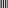

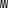
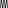

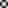
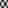
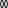

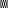

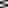
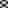
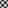

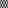
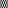

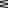

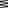

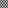
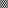

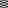
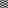
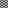

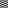

Here's a little slider that lets you play with each combo

[ sine image w/ x/y combo ]

Just like before, we can use these to split up an image. Lets start with this letter 'A'. It's pretty small, but we need it to be small otherwise we'll end up with too many other images.

[ A ]

Now, as we add more and more of these frequencies, we end up with something that becomes closer and closer to the actual image. But I think you'll see the pattern here, as we get a reasonable approximation with just a few of them.

[ Thing you can slide around ]

What happens with a JPEG is the image gets broken up into 8x8 chunks, and then each chunk gets 'fouriered' and saves the images. The number of frequencies that gets saved determines the quality of the image.

[ animation of how JPEGs work? ]

(sorry no interactively drawing your own image because I can't find any javascript library to do it)

## Conclusion

So lets recap:

- Fourier transforms are things that let us take something and split it up into its frequencies.
- We can use them to understand more what different sounds are like
- We can use them to compress data
- And we can also use them to make cool looking animations with a bunch of circles

This is just scratching the surface into some applications. The Fourier transform is an extremely powerful tool, because splitting things up into waves is so fundamental. They're used in a lot of fields, including circuit design, mobile phone signals, magnetic resonance imaging (MRI), and quantum physics!

## Questions for the curious

If you're interested learning about more applications you might want to think about:

- How do musical tuners use Fourier transforms?
- How do equalizer displays use Fourier transforms?
- Why do we need use Fourier transforms to tell how loud something is?
- How do we do a Fourier transform of a whole song, rather than just a wave?

If you're interested in the underlying principles of how it works, here are some questions you can use to guide your research:

- How do you mathematically represent a Fourier transform?
- What's the difference between a continuous time Fourier transform and a discrete time fourier transform?
- What are the other types of frequency domain transforms (Fourier transform is not the only one!)
- How do you computationally do a Fourier transform?
- What window functions and why would you use them?

## Further 'reading'

To learn more, some really good resources you can check out are:

[An Interactive Guide To The Fourier Transform](https://betterexplained.com/articles/an-interactive-guide-to-the-fourier-transform/)  
A great article that digs more into the mathematics of what happens.

[But what is the Fourier Transform? A visual introduction.](https://www.youtube.com/watch?v=spUNpyF58BY)  
A great Youtube video by 3Blue1Brown, also explaining the maths of Fourier transforms from an audio perspective.

[A Tale of Math & Art: Creating the Fourier Series Harmonic Circles Visualization](https://alex.miller.im/posts/fourier-series-spinning-circles-visualization/)  
Another article explaining how you can use epicycles to draw a path, explaing from a linear algerbra perspective.

[Fourier transform (Wikipedia)](https://en.wikipedia.org/wiki/Fourier_transform)  
And of course, the Wikipedia article is pretty good too.

## The author

<canvas id="its-meee" class="sketch" width=500 height=500></canvas>

I'm Jez! Full time I work at a search company in the Bay Area, and in my spare time I like making games and interactive code things like this!

If you want to see more of my work, check out my [homepage](/). On Twitter I'm [@jezzamonn](https://twitter.com/jezzamonn), and I'm currently posting fun little gifs there :)
